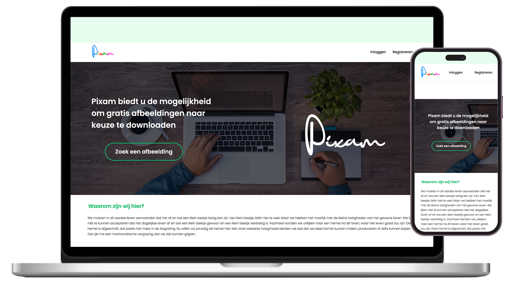
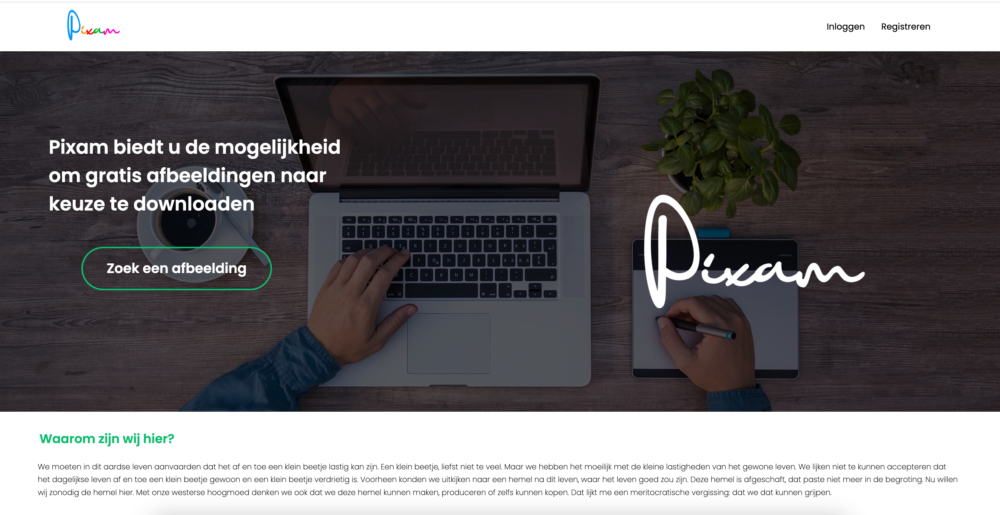
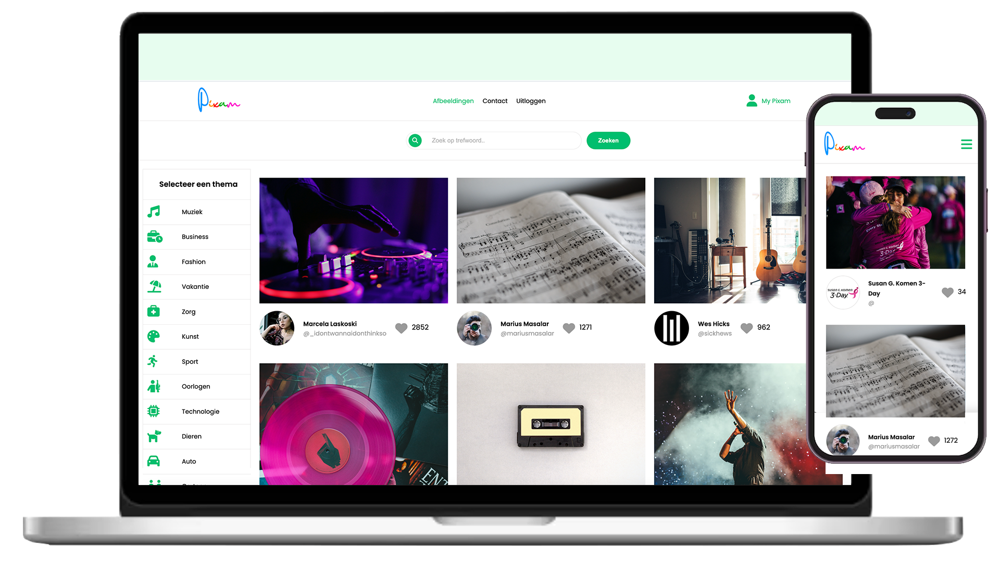
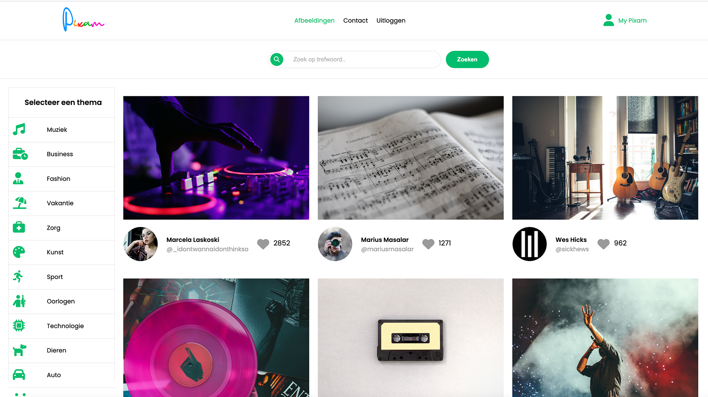
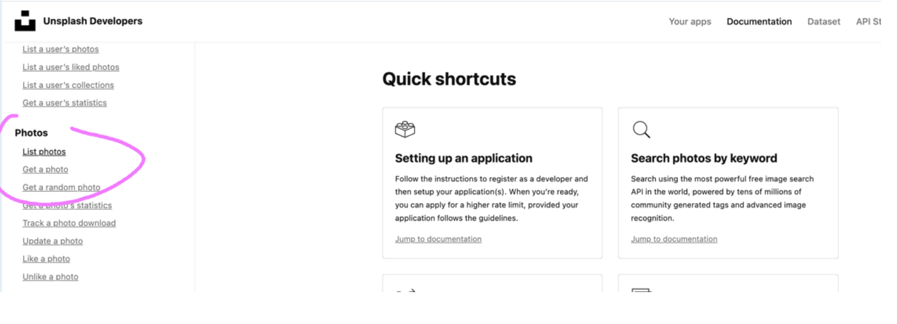
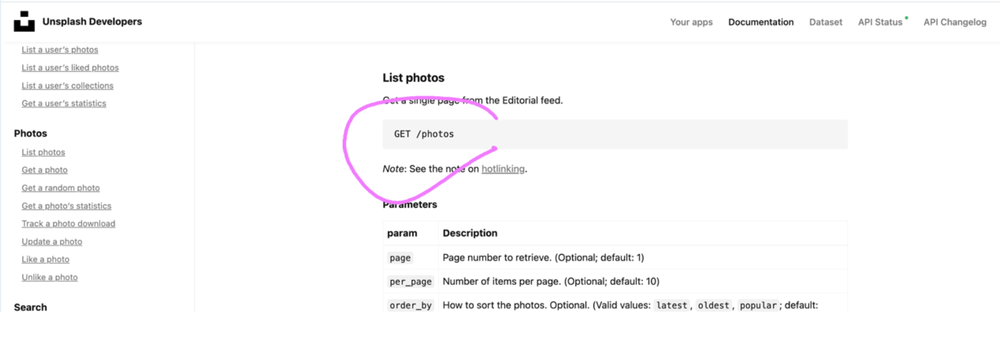

# ReadMe (Pixam)

###1. Opdrachtbeschrijving

   Voor u ligt de applicatie Pixam die ik heb ontwikkeld in het kader van mijn 
   cursus frontend-developer bij Novi Hogeschool. Deze applicatie is het 
   eindresultaat van de integrale opdracht Front-end.
   Pixam is een applicatie waarmee gebruikers gratis full HD- illustratieafbeeldingen 
   gemakkelijk online kunnen vinden en downloaden. Om de afbeeldingen te kunnen 
   downloaden moeten de gebruikers een account aanmaken waarmee ze toegang tot 
   de applicatie krijgen. Wanneer ze toegang hebben, kunnen ze een overzicht van 
   de verschillende afbeeldingen die beschikbaar zijn. De applicatie bevat een 
   zoekmachine waarmee de gebruikers afbeeldingen aan de hand van een trefwoord 
   kunnen zoeken. Daarnaast is er ook een filter die gebruikers ondersteundt om 
   gewenste afbeeldingen (die bij een bepaalde categorie horen) weer te geven. 
   Verder kunnen gebruikers een gewenste afbeelding bekijken en downloaden.
   De Pixam applicatie maakt gebruik van de unplash API waardoor de afbeeldingen 
   worden geïmporteerd.

Zo ziet de applicatie Pixam eruit wanneer de gebruiker op de startpagina belandt;




Zo ziet de inlogpagina van de applicatie Pixam eruit;




###2. Applicatie starten

Voordat u het project start, moet u het eerst clonen naar jouw locale machine door 
[hier](https://github.com/IlungaDesign/ilunga-pixam-encore) te klikken.
Nadat u het project hebt gecloned,
installeert u eerst de node_modules door het volgende commando 
in de terminal te typen:

```
npm install
```

Vervolgens kunt u de applicatie starten door de volgende 
commando te typen in uw terminal:

```
npm start
```

###3. React-Hook-Form installeren


Nadat u de applicatie hebt gestart, kunt u de ```React-Hook-Form``` library 
installeren. De ```React-Hook-Form``` library biedt de mogelijkheid om de validatie 
van invoervelden binnen formulieren uit te voeren. Met deze library 
hebt u de mogelijkheid om de fouten van de gebruiker te tonen tijdens 
het invullen en het valideren van gegevens in een invoerveld. Hier gaat het om 
gegevens van de gebruiker zoals (de gebruikersnaam, wachtwoord, telefoonnummer, 
selectievakje, enz...). Op deze wijze kan de gebruiker op de hoogte te zijn van zijn
fouten en kan deze verbeteren.

De ```React-Hook-Form``` library installeert u door de volgende commando te typen 
in uw terminal:

```
npm install react-hook-form
```

###4. React-Router installeren

Daarna kunt u de `React-router` library installeren. Deze library biedt 
de mogelijkheid om een navigatie van de SPA-pagina's te creëren. 

U kunt de `React-router` library installeren aan de hand van de hieronder 
commando:

```
npm install react-hook-form
```

###5. Axios installeren

Om de data (Afbeeldingen) van de unsplash API op te halen met behulp van een 
`GET-request` en de gegevens (gebruikersnaam, e-mail, gebruikerswachtwoord) naar 
de backend te sturen voor authenticatie met behulp van een `POST-request`, 
moet u de Axios installeren. Dit installeert door de volgende commando in de 
terminal te typen:
```
npm install axios
```
###6. Backend installeren

Aangezien dit project volledig een frontend-opdracht is, heb ik een backend 
van de Novi Hogeschool gekregen zodat het verzenden van `registratie en inlog 
gegevens` van de gebruikers binnen de applicatie mogelijk wordt. Deze backend 
draait op een `Heroku` server. Hij wordt automatisch inactief 
wanneer er een tijdje geen requests gemaakt worden. De eerste request die de 
server weer uit de `slaapstand` haalt zal daarom maximaal `30 seconden` op zich 
kunnen laten wachten. Daarna zal de responsetijd normaal zijn. Voer daarom 
altijd eerst een `test-request` uit.
[Hier](https://github.com/hogeschoolnovi/novi-educational-backend-documentation)
kunt u het volledige de documentation van de NOVI Educational Backend treffen.

###7. Randvoorwaarden

De applicatie Pixam heeft 7 pagina's met werkende routing, namelijk; 

- de pagina StartPagina (`"/"`) 
- de pagina Register (`"/register"`)
- de pagina Login (`"/login"`)
- de pagina Home (`"/home-page"`) 
- de pagina FotoDetails (`"/foto-details/:imageId"`)
- de pagina Contact (`"/contact"`)
- de pagina MyPixam (`"/my-pixam"`)

Daarnaast heeft de applicatie beveiligde routes en een Context de gebruikers 
in- en uitlogt. De beveiligde routes zijn;

- de pagina Home (`"/home-page"`)
- de pagina FotoDetails (`"/foto-details/:imageId"`)
- de pagina Contact (`"/contact"`)
- de pagina MyPixam (`"/my-pixam"`)

De backend draait op een `Heroku` server. Hij wordt automatisch inactief
wanneer er een tijdje geen requests gemaakt worden. De eerste request die de
server weer uit de `slaapstand` haalt zal daarom maximaal `30 seconden` op zich
kunnen laten wachten. Daarna zal de responsetijd normaal zijn. Voer daarom
altijd eerst een `test-request` uit.
[Hier](https://github.com/hogeschoolnovi/novi-educational-backend-documentation)
kunt u het volledige de documentation van de NOVI Educational Backend treffen.

U kunt het project hier clonen. In de README.md van het project staat 
beschreven hoe u de server kunt starten en welke endpoints er beschikbaar zijn. 
Lees deze documentatie grondig door.

Hieronder ziet u een aantal randvoorwaarden waaraan de applicatie Pixam voldoet..

- Alleen React met JavaScript wordt geaccepteerd als programmeertaal (geen TypeScript). Er mag geen Redux gebruikt worden.
- Het project is geüpload naar een GitHub repository: deze repository staat op public.
- Het project wordt ingeleverd zonder node_modules-map/.idea-map.
- Het project bevat de JavaScript linter ESLint (Bij gebruik van create-react-app is dit standaard meegeleverd).
- Alle wireframes zijn getekend op papier.
- Het prototype is ontworpen met Figma. software is helaas niet langer gratis.
- De applicatie start op zonder crashes.
- Er is géén gebruik gemaakt van out-of-the-box styling systemen zoals Bootstrap, Material-UI of Tailwind.
- Er wordt gebruik gemaakt van de NOVI-backend.
- Dit project wordt ook aangeleverd d.m.v. een ZIP-bestand van maximaal 50 MB. (Met de extensie .zip.


###8. Limitatie van de applicatie
   De huidige versie van de applicatie die ik inlever werkt niet helemaal omdat het me niet gelukt is om bepaalde technieken en functionaliteiten te kunnen implementeren. Hier gaat het om de onderstaande technieken en functionaliteiten.

####Inloggen via Facebook
      
Volgens mijn concept zou mijn applicatie het mogelijk maken voor de gebruiker om zich in te loggen via facebook. Deze functionaliteit zou efficiënt zijn voor de gebruiker (die een Facebook-account hebben) omdat ze hiermee toegang tot de applicatie na slechts 2 klikken kunnen hebben. Dat is handig.
      Het Front-end curriculum legt niet uit hoe deze techniek werkt, daarom heb ik geprobeerd mezelf online te documenteren via Google en YouTube. Dit zodat ik het kan implementeren in mijn applicatie, maar helaas kon ik de gewenste informatie niet vinden. Ik heb ook de heer Sam Barnhoorn benaderd om te vragen hoe de techniek kan verwerken in mijn applicatie en zo ben ik erachter gekomen dat het een zeer complexe techniek is die veel tijd kost. Gezien de tijd die ik had om mijn opdracht te ronden, was het onmogelijk om deze techniek te implementeren. Maar het blijft wel een mooie uitdaging voor de toekomst.

####Een afbeelding te delen naar de social media zoals Instagram, Facebook, Pinterest en Twitter.
      
We weten allemaal dat we in een tijd leven waarin mensen leuk vinden om afbeeldingen en video's via de volgende sociale media te delen, Instagram, Facebook, Pinterest en Twitter. Om die reden wilde ik een functionaliteit in de applicatie verwerken waarmee gebruikers de afbeeldingen delen via sociale media. Maar helaas net zoals het inloggen via Facebook, is deze techniek complexe en het vraagt meer tijd. Om die reden heb ik de techniek laten vallen en het blijft een uitdaging voor toekomstige projecten. 

###9. De Unsplash API 

Nadat ik een applicatie heb gecreëerd op Unsplash.com, heb ik toegang gekregen tot 2 dingen, namelijk mijn acces key en mijn secret key. Maar hier in deze opdracht hebben we meer de acces key nodig om een Get Request te doen, met andere woorden om de data (de afbeeldingen) op te halen.

Hieronder treft u de acces key en mijn secret key.
Access Key :

`3sZuQtQVCljncB-BTL7BmeRQGDybQmsP28B4dOybwko`

Secret key :

`J87LeEO0-2Xj1wZ7QxUz_ycT6QY9wnzVQYQEu99xyOI`

Wanneer u naar het stuk **documentation** in Unsplash gaat, kunt u naar een lijst van de foto’s die we kunnen hebben navigeren. Dit is te zien in de hieronder afbeelding;



Kunt ook zien dat de **GET-request** naar `GET /photo` gaat. Dit is te zien in de hieronder afbeelding;



Vervolgens heb ik de **link** hieronder gekopieerd en in de webrowser geplaatst, 
ik heb de `clien_id=` toegevoegd en mijn `acces key` aan het eind toegevoegd.

https://api.unsplash.com/photos?client_id=3sZuQtQVCljncB-BTL7BmeRQGDybQmsP28B4dOybwko

Deze link leidt me naar de pagina waar ik de data `(afbeeldingen, instagram-accounts, 
profielfoto’s en namen)` naar de applicatie Pixam kan importeren.
